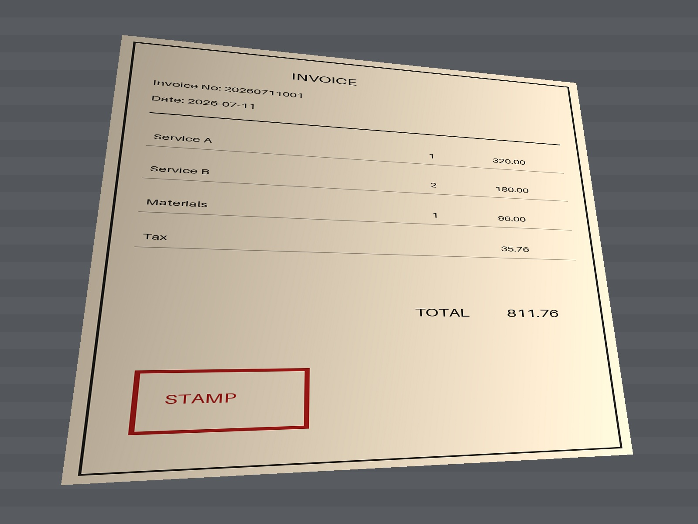
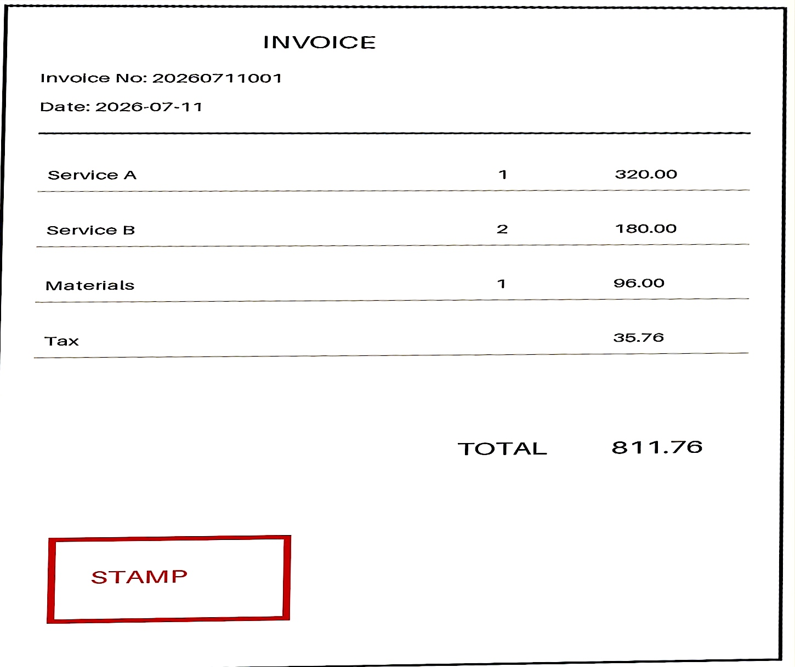

# macOS Invoice Auto Scan

在 Finder 中右键一张或多张票据照片，自动完成文档边缘识别、透视矫正和彩色扫描增强，并在原图旁生成 JPEG 与 PDF。

Right-click photographed invoices or documents in Finder to detect the paper, correct perspective, enhance them in a color scan style, and export JPEG and PDF files locally.

## 功能

- Finder 快速操作，一次点击完成处理
- 使用 macOS 原生 Vision 自动识别票据和纸张四角
- 自动矫正斜拍、梯形透视和照片方向
- 压平阴影与偏色，提白纸张背景，增强文字和表格线
- 保留红章、蓝章、签名等原始颜色
- 同时生成高质量 JPEG 和单页 A4 PDF
- 支持一次选择多张图片，绝不覆盖原图
- 完全本地处理，不上传照片，不常驻后台

## 效果预览

<p align="center">
  
  
</p>

左侧为带有倾斜、暖色偏色和不均匀阴影的模拟手机照片；右侧为自动裁边、透视矫正和彩色扫描增强后的结果。

## 系统要求

- macOS 15 或更高版本
- Xcode 或 Xcode Command Line Tools
- 已在 Apple Silicon Mac 上测试

## 安装

克隆仓库并运行安装脚本：

```bash
git clone https://github.com/ethansunqing/macos-invoice-auto-scan.git
cd macos-invoice-auto-scan
./install.sh
```

安装完成后，在 Finder 中选中 JPEG、PNG、HEIC 或其他图片，右键选择：

```text
快速操作 → 发票自动裁剪（图片+PDF）
```

程序会在原图旁生成：

```text
原文件名_自动裁剪.jpg
原文件名_自动裁剪.pdf
```

如文件已存在，会自动追加序号，不会覆盖已有文件。

## 命令行使用

安装后也可以直接调用：

```bash
"$HOME/Library/Application Support/InvoiceAutoCrop/invoice-autocrop" photo.jpg
```

可用参数：

```text
--both          同时输出 JPEG 和 PDF（默认）
--image-only    仅输出 JPEG
--pdf-only      仅输出 PDF
--no-enhance    不做彩色扫描增强，仅裁边和透视矫正
--output-dir    指定输出目录
```

## 卸载

```bash
./uninstall.sh
```

## 工作原理

1. `VNDetectDocumentSegmentationRequest` 检测文档边缘。
2. `CIPerspectiveCorrection` 完成透视矫正。
3. 大范围背景估计与局部光照归一化消除拍照阴影和偏色。
4. 保留颜色的对比度、降噪和锐化处理产生扫描效果。
5. ImageIO 与 Core Graphics 输出 JPEG 和 A4 PDF。

检测不到可靠纸张边缘时，程序会保留整张图片，避免错误裁切。

## 隐私

所有图像处理均在本机完成。程序不联网、不收集数据、不上传文件。

## 许可证

[MIT License](LICENSE)
